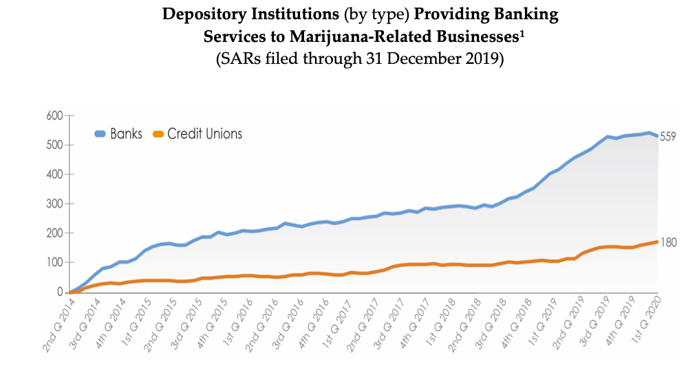

[comment]: # (Jeffrey,Scott,FinTech_Case_Study,HW1)

[comment]: # (Title,Company,Table_of_Contents)

# 
 Case Study Profile 
 GreenCheckVerified

## 
 Overview

____
  [GreenCheckVerified](greencheckverified.com)'s unique software solution is the pinnacle of many years planning and the time to execute is closing in on their horizon. With Congress poising the ideas included in the [MORE Act](https://www.cnn.com/2020/12/04/business/cannabis-more-act-house-vote/index.html), the foundation Kevin Hart has started is nothing but impressive. With over
  [6,000](https://www.statista.com/statistics/754751/medical-marijuana-dispensaries-number-by-state/)
  MRB just in the top 5 states alone, having a set foundation to start from was most pertainent to Mr. Harts beggining steps in his journey. Just like the internet buzz of early 2000's and how the fruit of those early companies are only just now ripe to sow, the Cannabis Industry is only in it's infancy.
____

## 
 Company Background

___
+ ### Founding date

  + Est. 2017

+ ### Founded by

  + Kevin Hart

+ ### HQ Located in

  + Yale University’s historic "Science Park" in New Haven, Connecticut
    + 262 State St, North Haven, Connecticut 06473, US [[1]](https://www.linkedin.com/in/kjhartnyc/)

+ ### How did GreenCheckVerified come to be in the beginning?

  + Green Check came from idea in 2016
    + How to develop a scalable platform that works within the banking industry that also communicates with the cannabis industry?[[2]](https://cannagather.com/ct/march2019)
  + Green Check's Software Solution in 2020
    + GCV’s(GreenCheckVerified) patent-pending proprietary software tool, "GreenCheck, an enterprise-grade platform that channels financial reporting and transactional compliance to enable verifiable and bankable commerce throughout the legal cannabis industry on a national scale. "GreenCheckVerified" is a company focused on driving responsible and sustainable growth of the legal cannabis industry"
    [[3]](https://www.cga.ct.gov/2018/GLdata/Tmy/2018HB-05458-R000315-Hart,%20Kevin,%20President-Green%20Check%20Verified-TMY.PDF)

+ ### How is the company funded? How much funding have they received?

  + 2 seed rounds resuting in $623.5k and $1.5 milion respectivly, and the latest in Oct 22, 2020 as a debt financing round to the amount of $450k. GreenCheckVerified is currently a fully privatized company.
    [[4]](https://www.crunchbase.com/organization/green-check-verified/company_financials)
    [[5]](https://sec.report/Document/0001760114-19-000002/)
  + Green Check Verified has brought in a total of roughly $4 million in funding to date

___

## 
 Business Activities

+ ### What specific financial problem is the company or project trying to solve?

  + There’s no central standard for  manufacturers and distributors creating an envrioment full of dispensaries, growers, manufacturers, distributors, and highly fragmented technology solutions. Since the majority of operators lack the size and ability to operate with economies of scale (e.g., Amazon), cost-efficiencies, like data sharing, marketing, route optimization, marketing analytics, and other marginal business expenses are higher than a more established consumer market."
  [[6]](https://cannatechtoday.com/how-the-cannabis-industry-is-pushing-the-limits-of-digital-payments/)

  

  + "Moreover, the lack of such requirements has created a gap in which scalable compliance systems and processes should exist in order to facilitate sustainable regulatory and oversight frameworks, especially those that would allow for the use of electronic payments as opposed to the high-risk nature of a cash-only industry. This last issue is amplified by the fact that marijuana is still classified as a Schedule 1 controlled substance under the federal Controlled Substance Act. This means that federal and state chartered financial institutions are wary of embracing the cannabis industry, no matter how well regulated it is on an individual state level.Financial Institutions, Regulators, and Business do not have a streamlinend way of communicating and there for subsequently find themselves creating a bottleneck of cash that is tied up.  Built for effieciency and reliability, GCV's purpose is to create a  streamlined and functional channel for MRB (Marijuana Related Business) to grow and thrive without the hastle of slow regulatory roadblocks tieing up their cash".
    [[3]](https://www.cga.ct.gov/2018/GLdata/Tmy/2018HB-05458-R000315-Hart,%20Kevin,%20President-Green%20Check%20Verified-TMY.PDF)
    [[7]](https://dealarchitect.typepad.com/.a/6a00d8345190da69e20240a4c429b1200d-pi)

+ ### Who is the company's intended customer?  Is there any information about the market size of this set of customers?

  + Marijuana Sellers, Consumers and State agencies (both regulators and tax collectors)
  + Market size is growing at a rate as fast as states legalize marijuana
    + "The SAFE Banking Act is one of the biggest points of discussion in the cannabis banking space. The consensus seems to be that passage of that legislation is inevitable, but it will not be this year, and Hart agrees. Though it may take time to come to fruition, more banks are interested in entering cannabis banking sooner rather than later. Green Check has carved out a strong niche for those strategic financial institutions that want to begin banking for cannabis",Hart.
    [[8]](https://www.newcannabisventures.com/green-check-verified-is-connecting-the-cannabis-industry-to-compliant-banking-services/)

+ ### What solution does this company offer that their competitors do not or cannot offer?

  + CEO Kevin Hart was the first to have started a project focused on banking in cannabis and also the first to have working software implemented in multiple state. CGV  carries a team of Banking Compliance Software Specialists, Financial Experts, and Client Engagement / Scale Specialist along with 3 potential patents pending for their technology processes.
  [[6]](https://cannatechtoday.com/how-the-cannabis-industry-is-pushing-the-limits-of-digital-payments/)

  + GCV have a proven track record, and a working service that is currently pushing to scale their Financial Institutions to help boost the number of MRB that can bank through their software.

  +

+ ### Which technologies are they currently using, and how are they implementing them?

  + KYC Automation, Remote Verification, Rfid Tracking and Inventory, Cash-Less Banking,

___

## 
 Landscape

+ ### What domain of the financial industry is the company in?

###  
 RegTech | Enterprise Solutions | Payments/Billing | Blockchain | Open Banking

   

  [[9]](https://www2.deloitte.com/us/en/pages/risk/articles/fintech-trends-insights.html)

+ ### What are the major market trends and innovations of this domain over the last 5-10 years?

  

  
  
  

  [[11]](https://www.canopyrivers.com/the-deep-end/blog-details/the-deep-end/2020/04/16/companies-powering-the-cannabis-software-industry)
  

  The amount of Technology and Software companies that are entering the sector is astounding, almost like we are back in 1999. This time however the banks are refusing to take cash from the brick and mortar companies which has created a huge grey area to exploit. This year alone, "The number of financial institutions serving marijuana-related businesses dropped 4.7% from 729 to 695 as of June 30, according to data by the Financial Crimes Enforcement Network (FinCEN), which is part of the U.S. Treasury Department.Banks with strong compliance programs are more comfortable serving cannabis-related firms."
  [[10]](https://mjbizdaily.com/marijuana-banking-numbers-slip-but-loans-may-be-increasing/)

+ ### What are the other major companies in this domain?

  + [Alt36](https://www.alt36.com) - Partnered with [Dash](https://www.dash.org) an open-source, transactional blockchain, used to record and track all transactions created — allowing for best-in-class speed, efficiency, accuracy, privacy, security and regulatory compliance. and [BLAZE](https://www.blaze.me), a company specializing in track and trace technologies that allows operators to maintain compliance, increase sales and productivity, improve customer retention and enhance service quality instantly.[[12]](https://www.alt36.com/partners)

  + [DropDelivery](https://www.dropdelivery.com) - All in one package. A customizable app dedicated to individual dispensaries backed by the makers of Drop rewards platform, Drop Technologies Inc. The Company is listed on Bloomberg with the Chariman [Onsi Naguib Sawiris CEO Italiaonline](https://www.bloomberg.com/profile/person/17658342). They have made an all-in-one suite of processes that is dialed into the specific needs of MRB to maintain banked and avoid the hinderances of industry specific reg and compliance. They even manage a network of drivers to deliver the goods securely. Made and operated in Canada.
  + [WeedMaps.com](https://weedmaps.com) - WeedMaps currently is only operating as a POS and Marketing tool for active dispensaries and customers on their website. Its possible that with the amount of data points they have on their customers (3 billion page visits per day), they could turn into a more Regulation and compliance facilitied by an online bank with greater ease than their competition.

___

## 
 Results

+ There is still nationwide friction between banks and MRB with the first critical area at the start with onboarding clients, it is evident that a unifide system needs to be in place. There is a high degree of uncertantiy in moving forward making it critical that legislation continues to progress in favor of cannabis reform nationwide before the true efforts of Mr.Hart will be fully appreciated. He, just like many others in the field are fighting to make it through to the end with as much work done connecting as many banks and their business clients as possible. Once cannabis becomes an inner-state commercially trafficed item, the system who has the most banks under their belt will come out on top. It will take an entire team across the country to help establish relationships with every region full of potential waiting clients, with many consolidating and releasing their client information. With the likes of: "Deloitte, ACTICO, IBM Corporation, Broadridge Financial Solutions, PWC, McAfee, London Stock Exchange Group, Thompson Reuters, Jumio, and NICE Actimize, among others" it's hard not to see how any of these startups have any other choice.[13](https://www.prnewswire.com/news-releases/regtech-market-to-reach-usd-21-73-billion-by-2027--cagr-of-19-5--reports-and-data-301076807.html)  
  
+ ### What are some of the core metrics that companies in this domain use to measure success?

  + Turnover Rate, Efficiency Ratio's, Cash held, Amount of SAR's reported in a set amount of time, Clients onboarded per account, number of banks onboarded, amount of credit extended through their software. There are any number of ways to record metrics for a company like this, I think the main one is that they still provide a solution to a much ignored problem.
  

+ In general, this company doesnt have that many specific stats other than benchmark standards. However, Steven Kemmerling - Founder & CEO CRB Monitor, operates a database with over 36,000 direct marijuana-related businesses, 98,000 marijuana licenses and 62,000 beneficial owners, making CRB Monitor is the most comprehensive database on the marijuana industry. If there are that many owner, operators and third parties out there there is certainly a need that will be filled if GreenCheckVerified can stay afloat.[14](https://www.crbmonitor.com/resources/cannabis-banking-101-)

#

#

#

# 
 Resources

## Websites

+ [FinTechBubble](https://medium.com/@balasanyan/fintech-bubble-the-end-is-near-634038d3d40d)

+ [GCV's White Paper](https://cdn2.hubspot.net/hubfs/5237927/Green%20Check%20Software%20Summary.pdf)

+ [World FinTech Report 2019](https://fintechworldreport.com/)

+ [Linkedin Profile : Kevin Hart](https://www.linkedin.com/in/kjhartnyc/)

+ [Crunchbase Company Financials](https://www.crunchbase.com/organization/green-check-verified/company_financials)

+ [S.E.C. Form D GreenCheckVerified](https://sec.report/Document/0001760114-19-000002/)

+ [New Cannabis Ventures](https://www.newcannabisventures.com/green-check-verified-is-connecting-the-cannabis-industry-to-compliant-banking-services/)

+ [Cannabis Digital Payments](https://cannatechtoday.com/how-the-cannabis-industry-is-pushing-the-limits-of-digital-payments/)

+ [MJBizNewsletter](https://mjbizdaily.com/marijuana-banking-numbers-slip-but-loans-may-be-increasing/)

+ [alt3 Partners](https://www.alt36.com/partners)

## Interviews

+ [Testimony of Kevin Hart](https://www.cga.ct.gov/2018/GLdata/Tmy/2018HB-05458-R000315-Hart,%20Kevin,%20President-Green%20Check%20Verified-TMY.PDF)

+ [Report on Kevin Hart](https://cannagather.com/ct/march2019)

## Images/Charts

+ [Market Sector Growth in RegTech](https://www2.deloitte.com/us/en/pages/risk/articles/fintech-trends-insights.html)

+ [Bubble forming in the Cannabis Industry](https://www.canopyrivers.com/the-deep-end/blog-details/the-deep-end/2020/04/16/companies-powering-the-cannabis-software-industry)

+ [Market Sector Data Chart](https://www.grandviewresearch.com/industry-analysis/regulatory-technology-market)

+ [How a FinTech Works with a Cannabis industry](https://www.enterpriseirregulars.com/146496/a-vertical-that-is-growing-well-like-a-weed/)