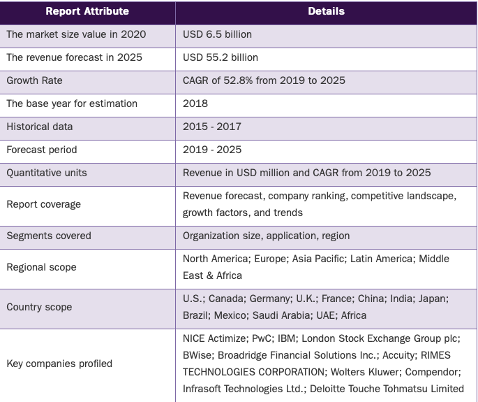

[comment]: # (Jeffrey,Scott,FinTech_Case_Study,HW1)

[comment]: #(Title,Company,Table_of_Contents)

# 
Case Study Profile

 GreenCheckVerified

## 
Overview

________
[comment]: # (Table_of_Contents)

+ ### Company Background

  + #### HQ Location

  + #### Questions / Answers

+ ### Business Activities

+ ### Landscape

+ ### Results

+ ### Recommendations

___

[comment]: #(Company_Background)

## 
Company Background

+ ### Founding date

  + Est. 2017

+ ### Founded by 

  + Kevin Hart

+ ### HQ Located in

  + Yale University’s historic "Science Park" in New Haven, Connecticut
    + 262 State St, North Haven, Connecticut 06473, US [[1]](https://www.linkedin.com/in/kjhartnyc/)

+ ### How did GreenCheckVerified come to be in the beginning?

  + Green Check came from idea in 2016
    + How can we develop a scalable platform that works within the banking industry, not around it, for the cannabis industry?[[2]](https://cannagather.com/ct/march2019)
  + Green Check's Software Solution in 2020
    + GCV’s(GreenCheckVerified) patent-pending proprietary software tool, GreenCheck, is an enterprise-grade platform that modernizes financial reporting and transactional compliance to enable verifiable and bankable commerce throughout the legal cannabis industry on a national scale. "GreenCheckVerified" is a company focused on driving responsible and sustainable growth of the legal cannabis industry 
    [[3]](https://www.cga.ct.gov/2018/GLdata/Tmy/2018HB-05458-R000315-Hart,%20Kevin,%20President-Green%20Check%20Verified-TMY.PDF)

+ ### How is the company funded? How much funding have they received?

  + 2 seed rounds resuting in 623.5k and 1.5 milion respectivly, and the latest in Oct 22, 2020 as a debt financing round to
    the amount of 450k 
    [[4]](https://www.crunchbase.com/organization/green-check-verified/company_financials)
    [[5]](https://sec.report/Document/0001760114-19-000002/)
  + Green Check Verified has brought in a total of roughly $4 million in funding to date

___

## 
 Business Activities

+ ### What specific financial problem is the company or project trying to solve?

  + The problem of underbanked cannabis companies is well-established and has created a legitimate issue in how payments are processed, and cash-flows are managed.Second, the cannabis market is highly fragmented. There’s no central aggregator for e-commerce manufacturers and distributors like Amazon in the blossoming industry. Instead, the market is flush with a garden variety of dispensaries, growers, manufacturers, distributors, and highly fragmented technology solutions.Because there is no large corporation operating with economies of scale (e.g., Amazon), cost-efficiencies, like data sharing, marketing, route optimization, marketing analytics, and other marginal business expenses are higher than a more established consumer market.
  [[#]](https://cannatechtoday.com/how-the-cannabis-industry-is-pushing-the-limits-of-digital-payments/)

  
  
  
  Moreover, the lack of such requirements has created a gap in which scalable compliance systems and processes should exist in order to facilitate sustainable regulatory and oversight frameworks, especially those that would allow for the use of electronic payments as opposed to the high-risk nature of a cash-only industry. This last issue is amplified by the fact that marijuana is still classified as a Schedule 1 controlled substance under the federal Controlled Substance Act. This means that federal and state chartered financial institutions are wary of embracing the cannabis industry, no matter how well regulated it is on an individual state level.Financial Institutions, Regulators, and Business do not have a streamlinend way of communicating and there for subsequently find themselves creating a bottleneck of cash that is tied up. Green Check's objective is to bridge the gap between all the players involved with the likes of:  marijuana sellers, consumers and state agencies (both regulators and tax collectors) Built for effieciency and reliability, GCV's purpose is to create a  streamlined and functional channel for MRB (Marijuana Related Business) to grow and thrive without the hastle of slow regulatory roadblocks tieing up their cash. 
    [[3]](https://www.cga.ct.gov/2018/GLdata/Tmy/2018HB-05458-R000315-Hart,%20Kevin,%20President-Green%20Check%20Verified-TMY.PDF)
    [[#]](https://dealarchitect.typepad.com/.a/6a00d8345190da69e20240a4c429b1200d-pi)

+ ### Who is the company's intended customer?  Is there any information about the market size of this set of customers?

  + Marijuana Sellers, Consumers and State agencies (both regulators and tax collectors)
  + Market size is growing at a rate as fast as states legalize marijuana
    + The SAFE Banking Act is one of the biggest points of discussion in the cannabis banking space. The consensus seems to be that passage of that legislation is inevitable, but it will not be this year, and Hart agrees. Though it may take time to come to fruition, more banks are interested in entering cannabis banking sooner rather than later. Green Check has carved out a strong niche for those strategic financial institutions that want to begin banking for cannabis, according to Hart.
    [[6]](https://www.newcannabisventures.com/green-check-verified-is-connecting-the-cannabis-industry-to-compliant-banking-services/)

+ ### What solution does this company offer that their competitors do not or cannot offer? (What is the unfair advantage they utilize?)

  + CEO Kevin Hart was the first to have started a project focused on banking in cannabis and also the first to have working software implemented in multiple state. CGV cvg carries a team of Banking Compliance Software Specialists, Financial Experts, and Client Engagement / Scale Specialist along with 3 potential patents pending for their technology processes.
  [#](https://cannatechtoday.com/how-the-cannabis-industry-is-pushing-the-limits-of-digital-payments/)

  + GCV have a proven track record, and a working service that is currently pushing to scale their Financial Institutions to help boost the number of MRB that can bank through their software.

+ ### Which technologies are they currently using, and how are they implementing them?

  + asdf

___

## 
Landscape

+ ### What domain of the financial industry is the company in?

###  
RegTech | Enterprise Solutions | Payments/Billing | Blockchain | Open Banking
  

[[7]](https://www2.deloitte.com/us/en/pages/risk/articles/fintech-trends-insights.html)

+ What have been the major trends and innovations of this domain over the last 5-10 years?
  

  
  

  [[8]](https://www.grandviewresearch.com/industry-analysis/regulatory-technology-market)

+ What are the other major companies in this domain?

  + [Alt36](https://www.alt36.com)
  + [DropDelivery](https://www.dropdelivery.com)
  + [Strike](https://medium.com/@JimmyMow/announcing-strike-by-zap-4f578c7c8984)
  + [WeedMaps](https://weedmaps.com)
___

## 
Results

+ What has been the business impact of this company so far?
  
+ What are some of the core metrics that companies in this domain use to measure success? How is your company performing, based on these metrics?
  + s
+ How is your company performing relative to competitors in the same domain?
  + s

___

## 
Recommendations

+ If you were to advise the company, what products or services would you suggest they offer? (This could be something that a competitor offers, or use your imagination!)

+ Why do you think that offering this product or service would benefit the company?

+ What technologies would this additional product or service utilize?

+ Why are these technologies appropriate for your solution?

#

#

#

# 
 Works Cited
## 
 Websites

+ [2] : [GCV's White Paper](https://cdn2.hubspot.net/hubfs/5237927/Green%20Check%20Software%20Summary.pdf)

+ [3] : [Crunchbase Company Profile : Greencheckverified](https://www.crunchbase.com/organization/green-check-verified)

+ [4] : [World FinTech Report 2019](https://fintechworldreport.com/)

+ [1] : [Linkedin Profile : Kevin Hart](https://www.linkedin.com/in/kjhartnyc/)

+ [#] : [Linkedin Profile : Green Check Verified](https://www.linkedin.com/in/kjhartnyc/)

+ [4] : [Crunchbase Company Financials](https://www.crunchbase.com/organization/green-check-verified/company_financials)

+ [5] : [S.E.C. Form D GreenCheckVerified](https://sec.report/Document/0001760114-19-000002/)

+ [6] : [New Cannabis Ventures](https://www.newcannabisventures.com/green-check-verified-is-connecting-the-cannabis-industry-to-compliant-banking-services/)

+ [#] : (https://cannatechtoday.com/how-the-cannabis-industry-is-pushing-the-limits-of-digital-payments/)

## 
Interviews

+ [3] : [Testimony of Kevin Hart](https://www.cga.ct.gov/2018/GLdata/Tmy/2018HB-05458-R000315-Hart,%20Kevin,%20President-Green%20Check%20Verified-TMY.PDF)

+ [2] : [Report on Kevin Hart](https://cannagather.com/ct/march2019)

## 
Images/Charts

+ [7] : [Market Sector Growth in RegTech](https://www2.deloitte.com/us/en/pages/risk/articles/fintech-trends-insights.html)

+ [#] : [Past and Forecasted Growth Rate in RegTech Graph](https://www.grandviewresearch.com/industry-analysis/regulatory-technology-market)

+ [#] : [Market Sector Data Chart](https://www.grandviewresearch.com/industry-analysis/regulatory-technology-market)

+ [#] : [How a FinTech Works with a Cannabis industry](https://dealarchitect.typepad.com/.a/6a00d8345190da69e20240a4c429b1200d-pi)